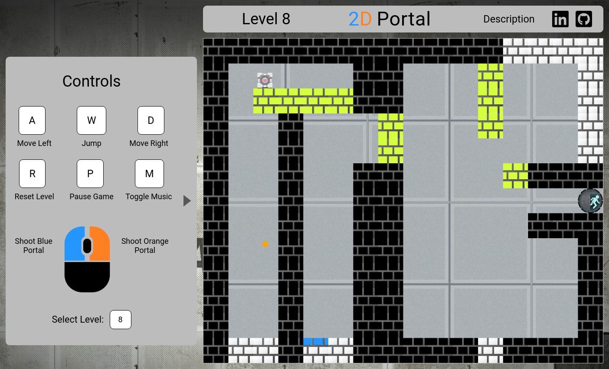

## 2D - Portal

### [Live Site](https://mwojick.github.io/2D-Portal/)

- [Introduction](#introduction)
- [Features](#features)
- [Screenshot](#screenshot)
- [Technologies Used](#technologies-used)
- [Technical Challenge](#technical-challenge)
- [Build Process](#build-process)

### Introduction

2D Portal is a puzzle-platformer game inspired by the Portal series of games. The player navigates through a series of levels by strategically placing portals in two different places and moving between them.

### Technologies Used

- HTML/CSS/SCSS
- JavaScript for game physics and logic.
- HTML5 Canvas for DOM manipulation and rendering.
- Webpack to bundle up the JS files.
- Font Awesome for icons.

### Features

In 2D Portal, users can:

- [x] Move and jump around the map using movement keys
- [x] Shoot portals onto walls using mouse buttons
- [x] Move between the two portals
- [x] See a description of the controls, and objective of the game

### Screenshot

The app consists of a main canvas element with gameplay elements inside, with a description of the game in modal form (by clicking on the description button):



### Technical Challenge

The most difficult technical challenge for this project was translating the users coordinates and velocities when they go through portals. The collision detection algorithm used for this project returns a letter based on the side that the first box was hit on (b, t, r, l for bottom, top, right, and left, respectively). Using this information, I take the side that the exit portal was shot on and use that to determine how to teleport the player. For instance, one of the cases in the switch statement for my teleport function is as follows:

```JavaScript
export const teleport = (player, box1, box2) => {
  switch (box2.dir) {
    case 'b':
      player.x = box2.x + box2.width/2 - player.width/2;
      player.y = box2.y - player.height - 1;
      if ( box1.dir === 'r'
            && player.velY > 0) {
            player.velY = -player.velY - player.velX;
      }
      if ( box1.dir === 'l'
            && player.velY > 0) {
            player.velY = -player.velY + player.velX;
      }
      if (box1.dir === 'b') {
        player.velY = -player.velY;
      }
      break;

      ...
  }
}
```

box1 represents the portal that the player collided with, and box2 is the portal that the player will teleport to. box1 and box2 both have a direction (dir) attribute that corresponds to how the portal was formed when the player originally shot the portal (i.e. the direction the portal was shot from). The player's x and y coordinates are set based on the location of the second portal (box2), and the player's velocity is based on the dirs of both portals to create a natural feeling of velocity transfer. for instance, if both portals are on the ground (both have dir === 'b'), jumping down portal1 should invert their vertical velocity when exiting from portal2.

### Build Process:

1. `npm install`
2. For making changes to scss: `sass --watch scss:css`

#### Hint for levels 10-11

- 10 - You can still shoot portals when the game is paused.
- 11 - The reset button preserves your velocity. :)
